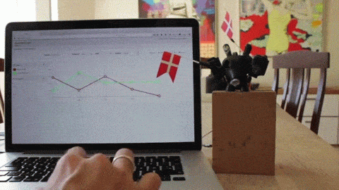

# Go-Johnny-Go
### Browser based UI to manage Johnny Five animations

**Go-Johnny-Go is a web based user interface to create and manage animations to be used with the [Johnny-Five Robotics Programming Framework](http://johnny-five.io)**

Johnny-Five has very powerful [animations capabilities](http://johnny-five.io/api/animation/)
but describing keyFrames and cue positions for a lot of servos in code, can be a bit tiring.

Go-Johnny-Go allows you to create and edit animation segments using a browser base user interface. 

## See it in action

 
[YouTube Demo Video](https://www.youtube.com/watch?v=KcosuPESzKk)

##This project is still under development. 

Status: finishing the UIX

Next: Control hardware via Sockets.IO

##Roadmap:
* Control attached hardware via Sockets.IO
* Change ease type for keyFrames
* Allow keyFrames to be null

## License
Copyright (c) 2015 Ronald Jaramillo <ronald@burningservos.com>
Licensed under the MIT license.
